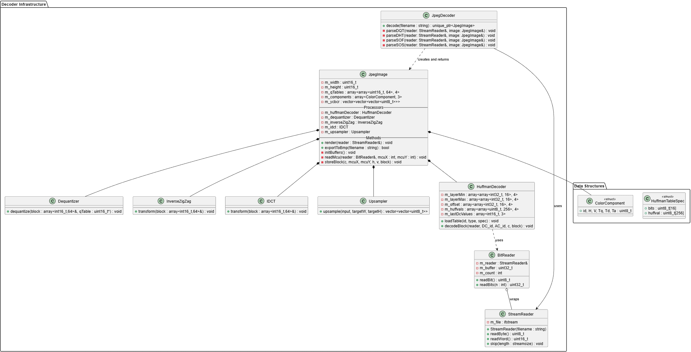

# Baseline JPEG Decoder

這是一個Baseline JPEG 解碼器練習專案。本專案以過去資訊理論與編碼的學期作業為基礎，透過現代 C++ 完成重構的練習專案。




## 專案核心目標
- **模組化與低耦合設計**：將 JPEG 解碼流程（包含 Huffman 解碼、反量化、ZigZag 轉換、IDCT、升採樣等）徹底解耦。設計上預先考慮了擴充性，降低未來導入切換演算法時需要實作 Strategy Pattern 或 DI 的實作難度。
- **展示工程實作細節**：透過清晰的物件導向架構與類別職責劃分，呈現對 JPEG 分段解析邏輯的掌握。
- **現代工具協作**：在主架構設計完全自主掌握的前提下，利用 AI (LLM) 輔助實作部分標準算法與協助局部重構，藉此提升開發與優化效率。

## 系統架構 (Modules)
本專案採用解耦的模組化設計：
- `StreamReader` & `BitReader`: 處理檔案串流讀取與位元等級的資料存取。
- `HuffmanDecoder`: 負責 JPEG Huffman 編碼表的載入與編碼資料流的解碼。
- `Dequantizer`: 執行量化表的反量化動作。
- `InverseZigZag`: 將 1D 資料序列重新排列回 8x8 Block 結構。
- `IDCT` (AI Assisted): 執行離散餘弦逆變換，將頻域係數轉換回空間空間數據。
- `Upsampler`: 執行色度升採樣 (Chroma Upsampling)。
- `JpegDecoder`: 管理整個解碼管線。
- `JpegImage`: 存儲影像數據，並提供 `exportToBmp` (AI Assisted) 功能將結果導出為 BMP 格式。

## 範例用法
```cpp
#include "decoder/Decoder.hpp"

int main() {
    // 初始化解碼器
    Jpeg::Decoder::JpegDecoder decoder;
    
    // 執行解碼並將結果匯出為影像檔案
    decoder.decode("input.jpg")->exportToBmp("output.bmp");
    
    return 0;
}
```

## 重構歷程與 AI 協同開發
在本專案的重構實作過程中，我採取了「設計主導、AI 協作」的策略，確保架構品質與開發效率並重：

1. **架構設計 (Human-Led)**：
   - **職責單一化 (SRP)**：決定將所有核心演算法獨立拆分，解決早期程式碼緊密耦合、難以測試的問題。
   - **優化指令分派機制**：在`JpegDecoder` 中，利用 C++11 的 `std::function` 與陣列取代了傳統龐大且難以維護的 `switch-case`。這種 Dispatch Table 設計確保了主迴圈的簡潔性，並預留了未來擴充新 Marker（如 APPn 或 COM）的彈性。
   - **擴充性考量**：隔離各模組介面，使未來能以最低成本套用設計模式來優化特定演算法實現。

2. **AI 輔助實作 (AI-Assisted)**：
   - **特定算法實作**：例如 IDCT 的核心變換邏輯 (`IDCT.cpp`) 以及 BMP 檔案格式封裝 (`Image.cpp`) 等具標準規範的代碼生成。
   - **開發效率提升**：在確立整體架構藍圖後，利用 AI 協助處理重複性較高的樣板程式碼 (Boilerplate code) 與局部語法優化，使我能將心力專注於系統流程的正確性。
